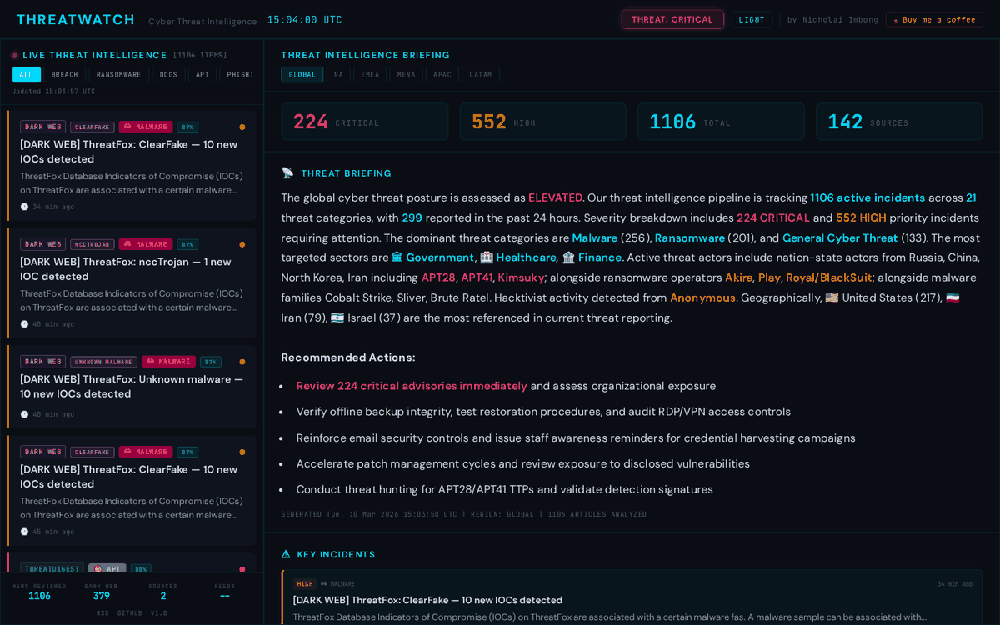

<div align="center">

# ThreatWatch

**AI-powered cyber threat intelligence platform — zero cost**

[](https://www.python.org/)
[](LICENSE)
[](docker-compose.yml)
[]()
[]()
[]()
[](https://github.com/AuvaLabs/threatwatch)

**[Live Demo](https://threatwatch.auvalabs.com)** · **[GitHub Pages](https://auvalabs.github.io/threatwatch/)**

AI-powered threat intelligence platform that aggregates 155+ RSS feeds, dark web sources, and NewsAPI — classifies, deduplicates, and generates analyst-grade intelligence briefings with confidence-rated findings, threat forecasts, and actionable priority recommendations. Runs entirely free using Groq's API free tier. Self-hosted, zero-cost infrastructure.

[Features](#features) · [Quick start](#quick-start) · [Configuration](#configuration) · [Architecture](#architecture) · [API](#api-endpoints) · [Contributing](#contributing)

</div>

---

## Dashboard



---

## Features

### Collection
- **155+ RSS feeds** — security blogs, vendor advisories, CERTs worldwide, Google News, Bing News
- **NewsAPI integration** — additional security news with rate-limited fetching (100 req/day free tier)
- **Dark web monitoring** — ThreatFox IOCs, ransomware victim tracking (ransomware.live), active C2 server IPs
- **10-minute pipeline** cycle with automatic GitHub Pages deployment every 15 minutes
- **8-thread parallel fetching** — processes all feeds in seconds
- Rolling **7-day window** with merge across pipeline runs

### Classification
- **24 threat categories**: Ransomware, Zero-Day, APT/Nation-State, DDoS, Supply Chain, Phishing, Malware, Data Breach, Vulnerability, Threat Research & Analysis, Detection & Response, and more
- **75+ threat actors and malware families** (APT28, LockBit, Lazarus Group, Scattered Spider, Salt Typhoon, etc.)
- **Content-aware region attribution** — infers geographic region from article title, not just feed locale
- ISO-3166 country code mapping for ransomware victim data (DE → Europe, JP → APAC, BR → LATAM, etc.)
- **15 industry sectors**
- **Noise filtering** — product announcements, job listings, funding rounds, training content auto-excluded

### Deduplication
- Fuzzy matching with a **word-shingle inverted index** (24x faster than naive pairwise)
- CVE-aware deduplication — articles reporting different CVEs are never merged
- Cross-source region merge, collapsing to Global when an article spans 3+ regions

### Dashboard
- Server-side rendered, **loads in under a second**
- **Single HTML file** — no build step, no framework, no JavaScript bundle; IBM Plex Mono + Space Grotesk typography
- **Category tabs**: Intel Brief, Ransomware, APT, Breach, DDoS, Phishing, Malware, Zero-Day, Vuln, Dark Web, Research, Brands, Tech
- Category tabs filter the left-panel live feed — one click to see all matching articles
- **Brand Watch tab** — monitor specific brands/organisations; selecting a brand filters the left panel
- **Tech Watch tab** — 244 technology vendors across 18 categories; selecting a vendor filters the left panel
- Watch filter banner in the left panel shows the active brand/vendor filter at a glance
- **Ransomware Tracker** — victim posts from ransomware.live + ransomware news, grouped by threat actor
- **APT Tracker** — actor intelligence grid with drilldown into news articles
- Key incidents panel, threat actor spotlight, sector impact panels with drilldown
- Article detail view with IOC extraction (CVEs, IPs, hashes, domains)
- Watchlist preferences saved to localStorage; self-hosted installs can persist keywords server-side
- **AI intelligence briefing** — analyst-grade assessments with confidence-rated findings, threat forecasts, sector impact analysis, and priority actions tied to specific observed threats (any LLM provider — Groq free tier recommended)
- Auto-generated statistical briefing as fallback (zero cost, no API key needed)
- **5 switchable themes** — Nightwatch (dark brass), Parchment (light cream), Solarized, Arctic (clean blue), Phosphor (retro CRT)
- Both live URLs displayed in the page footer

### Region accuracy
- **Content-based inference** — scans article title for country/demonym mentions and assigns the correct region, overriding feed locale labels (a UK article from a US-localized Google feed gets tagged Europe, not US)
- **ISO-2 code support** — ransomware.live victim data uses 2-letter codes (DE, FR, GB); fully mapped
- **Multi-region collapse** — articles appearing in 4+ regional feeds collapse to Global instead of producing long joined tags like `Canada,India,Singapore,UAE,US`

### Integration
- RSS feed output for feed readers and SIEMs
- JSON API for programmatic access
- CORS enabled for embedding in other dashboards

---

## Quick start

### Docker Compose (recommended)

```bash
git clone https://github.com/AuvaLabs/threatwatch.git
cd threatwatch

# Optional: configure environment
cp .env.example .env   # edit as needed

# Start everything
docker compose up -d
```

The pipeline runs immediately on startup, then every 10 minutes. Dashboard is at **http://localhost:8098**.

### Manual setup

```bash
git clone https://github.com/AuvaLabs/threatwatch.git
cd threatwatch

python3 -m venv venv
source venv/bin/activate
pip install -r requirements.txt

mkdir -p data/output/hourly data/output/daily \
         data/state/ai_cache \
         data/logs/run_logs data/logs/summaries

# Run the pipeline once
python threatdigest_main.py

# Start the dashboard server
python serve_threatwatch.py
```

For automatic refresh, add a cron job:

```cron
*/10 * * * * cd /path/to/ThreatWatch && /path/to/venv/bin/python threatdigest_main.py >> data/logs/cron.log 2>&1
```

---

## Configuration

### Environment variables

| Variable | Default | Description |
|---|---|---|
| `PORT` | `8098` | Dashboard server port |
| `SITE_DOMAIN` | `localhost:8098` | Domain for RSS feed links |
| `FEED_CUTOFF_DAYS` | `7` | Rolling window for articles |

### Optional: NewsAPI

Sign up at [newsapi.org](https://newsapi.org) for a free API key (100 requests/day). ThreatWatch automatically rate-limits to stay within the free tier.

| Variable | Default | Description |
|---|---|---|
| `NEWSAPI_KEY` | _(empty)_ | newsapi.org API key |
| `NEWSAPI_INTERVAL` | `1800` | Seconds between NewsAPI calls (default 30 min) |

### Optional: AI intelligence briefing

ThreatWatch works without any API keys. To enable AI-powered intelligence briefings with confidence-rated findings and threat forecasts, configure any OpenAI-compatible LLM provider:

| Variable | Default | Description |
|---|---|---|
| `LLM_API_KEY` | _(empty)_ | API key for your LLM provider |
| `LLM_BASE_URL` | `https://api.openai.com/v1` | API base URL |
| `LLM_MODEL` | `gpt-4o-mini` | Model name |
| `LLM_PROVIDER` | `auto` | `auto`, `openai`, `anthropic`, `ollama` |

**Recommended free setup** — [Groq](https://console.groq.com) provides free API access:

```env
LLM_API_KEY=gsk_your_key_here
LLM_BASE_URL=https://api.groq.com/openai/v1
LLM_MODEL=llama-3.3-70b-versatile
LLM_PROVIDER=openai
```

Also works with OpenAI, Together, Ollama (local), Mistral, DeepSeek, and any OpenAI-compatible API. Rate-limited to 1 API call per hour.

### Feed configuration

Feeds are defined in YAML files under `config/`:

| File | Description |
|---|---|
| `feeds_native.yaml` | Security blogs, vendor advisories, CERTs |
| `feeds_google.yaml` | Google News search queries (regional + threat-specific) |
| `feeds_bing.yaml` | Bing News search queries |

Edit these files to add or remove feeds. No restart needed — changes apply on the next pipeline run.

---

## Architecture

**Pipeline** (`threatdigest_main.py`): Feeds → Fetch → Deduplicate → Scrape → Classify → Region Inference → Output

**Server** (`serve_threatwatch.py`): Python HTTP server with SSR, ETag caching, gzip, CORS

**Frontend** (`threatwatch.html`): Single HTML file. No build step, no framework.

**Storage**: Flat JSON files. No database, no Redis, no message queue.

### Project structure

```
threatdigest_main.py         # Pipeline orchestrator
serve_threatwatch.py         # HTTP server with SSR
threatwatch.html             # Dashboard UI (single file)
modules/
  ├── feed_loader.py         # YAML feed config parser
  ├── feed_fetcher.py        # Parallel RSS fetcher
  ├── deduplicator.py        # Fuzzy dedup (word-shingle index)
  ├── article_scraper.py     # Full-text extraction
  ├── keyword_classifier.py  # Zero-cost regex classifier
  ├── region_inferrer.py     # Content-based region attribution
  ├── briefing_generator.py  # AI briefing (any LLM provider)
  ├── darkweb_monitor.py     # Dark web intel aggregation
  ├── newsapi_fetcher.py     # NewsAPI security news feed
  ├── output_writer.py       # JSON/RSS output
  ├── config.py              # Global configuration
  └── ...
config/
  ├── feeds_native.yaml      # Security blogs & CERTs
  ├── feeds_google.yaml      # Google News feeds
  └── feeds_bing.yaml        # Bing News feeds
scripts/
  ├── deploy_gh_pages.py     # GitHub Pages static deploy
  ├── validate_feeds.py      # Feed health checker
  └── cleanup.py             # Data cleanup utility
data/
  ├── output/                # JSON + RSS output files
  ├── state/                 # Pipeline state & cache
  └── logs/                  # Run logs & summaries
tests/                       # Test suite (80%+ coverage)
docker-compose.yml           # Two-service deployment
Dockerfile                   # Python 3.11-slim based
```

---

## API endpoints

The server runs on port **8098** by default:

| Method | Path | Description |
|---|---|---|
| `GET` | `/` | Dashboard (server-side rendered HTML) |
| `GET` | `/api/articles` | All articles as JSON array |
| `GET` | `/api/articles?offset=0&limit=20` | Paginated articles |
| `GET` | `/api/briefing` | AI intelligence briefing |
| `GET` | `/api/stats` | Pipeline run statistics |
| `GET` | `/api/health` | Server health + feed status |
| `GET` | `/api/stix` | STIX 2.1 bundle export |
| `GET` | `/api/watchlist` | Watchlist config + vendor list |
| `POST` | `/api/watchlist` | Update watchlist (self-hosted) |
| `GET` | `/api/rss` | RSS feed (XML) |

All JSON endpoints support CORS, ETag conditional requests, and gzip compression.

<details>
<summary>Example: paginated articles response</summary>

```json
{
  "articles": [
    {
      "title": "LockBit ransomware targets healthcare sector",
      "translated_title": "LockBit ransomware targets healthcare sector",
      "link": "https://example.com/article",
      "published": "2026-03-21T10:00:00+00:00",
      "category": "Ransomware",
      "confidence": 95,
      "is_cyber_attack": true,
      "summary": "Brief summary of the article...",
      "region": "US",
      "assetTags": ["CrowdStrike"],
      "related_articles": []
    }
  ],
  "total": 150,
  "offset": 0,
  "limit": 20,
  "has_more": true
}
```

</details>

<details>
<summary>Example: health response</summary>

```json
{
  "status": "ok",
  "uptime_s": 3600,
  "last_run_at": "2026-03-21T10:00:00+00:00",
  "articles_total": 150,
  "articles_cyber": 120,
  "api_cost_today_usd": 0.05,
  "feed_health": {"ok": 140, "dead": 5, "slow": 10},
  "generated_at": "2026-03-21T10:05:00+00:00"
}
```

</details>

---

## Running tests

```bash
pip install -r requirements.txt
pytest tests/ -v
pytest tests/ --cov=modules --cov-report=term-missing
```

---

## Contributing

See [CONTRIBUTING.md](CONTRIBUTING.md) for details. The short version:

1. Fork the repo
2. Create a branch (`git checkout -b feat/your-feature`)
3. Write tests, keep coverage above 80%
4. Follow existing code style
5. Run `pytest tests/ -v`
6. Commit using [conventional commits](https://www.conventionalcommits.org/) (`feat:`, `fix:`, etc.)
7. Open a PR

### Good first contributions

- New RSS feed sources or CERTs
- Threat actor or malware family patterns
- Dashboard visualisations
- STIX/TAXII export
- Webhook or notification integrations

---

## Security

See [SECURITY.md](SECURITY.md) for the security policy and how to report vulnerabilities responsibly.

---

## License

ThreatWatch is **open source for non-commercial use**.

See [LICENSE](LICENSE) for the full terms or contact [nicholai.me](https://nicholai.me).

---

<div align="center">

by [nicholai.me](https://nicholai.me) · [AuvaLabs](https://github.com/AuvaLabs)

[](https://buymeacoffee.com/nicholai.me)

</div>
