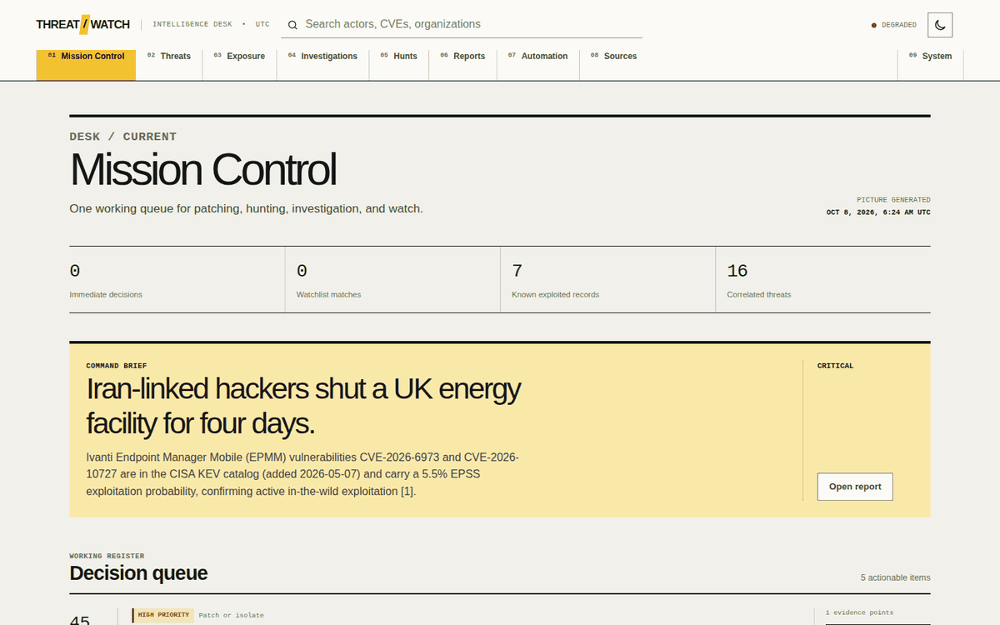

<div align="center">

# ThreatWatch

**Analyst-focused cyber threat intelligence aggregation and briefing**

[](https://www.python.org/)
[](LICENSE)
[](docker-compose.yml)
[]()
[]()
[](https://github.com/AuvaLabs/threatwatch)

**[Live Demo](https://threatwatch.auvalabs.com)**

Threat intelligence platform that aggregates RSS feeds, public dark web sources, NVD, and NewsAPI. It classifies and deduplicates coverage, then produces source-linked briefings, priority stories, incident context, and analyst actions. The core feed works without an LLM; optional AI capabilities support independent provider fallback.

[Features](#features) · [Quick start](#quick-start) · [Configuration](#configuration) · [Architecture](#architecture) · [API](#api-endpoints) · [Integrations](docs/INTEGRATIONS.md) · [Contributing](#contributing)

</div>

---

## Dashboard



---

## Features

### Collection
- **141 RSS feeds** covering security blogs, vendor advisories, CERTs, Google News, and Bing News
- **NewsAPI integration** — additional security news with rate-limited fetching (100 req/day free tier)
- **Dark web monitoring** — ThreatFox IOCs, ransomware victim tracking (ransomware.live), active C2 server IPs
- **Continuous pipeline** with a new cycle every 10 minutes and typical completion in 2 to 4 minutes
- **16-thread parallel fetching** with date rejection before network-heavy URL resolution
- Rolling **7-day window** with merge across pipeline runs
- **Briefing-first default feed** keeps bulk NVD and Vulners telemetry in the Exploits tab while retaining KEV-listed vulnerabilities in the main news stream

### AI intelligence with provider fallback
- **Intelligence Digest** — hourly AI-generated threat landscape summary with trending threats, vulnerability spotlight, sector impact, and priority actions — every finding links back to source articles
- **Top Stories** — AI picks the 5-8 most significant incidents from all articles, with significance ratings (CRITICAL/HIGH/MODERATE)
- **Article Summaries** — structured AI summaries (what/who/impact) for articles missing descriptions
- **Incident Clustering** groups related coverage only on shared CVEs or named threat actors, with optional grounded synthesis
- **Threat Actor Profiles** — cached AI-generated profiles for detected actors (origin, TTPs, target sectors)
- **AI Classification Escalation**: low-confidence articles can be reclassified by the configured LLM route
- **Provider resilience**: primary key rotation plus two independent OpenAI-compatible fallback endpoints
- **Honest health**: freshness and latest-run status for global, regional, top-story, and summary capabilities

### Classification
- **24 threat categories**: Ransomware, Zero-Day, APT/Nation-State, DDoS, Supply Chain, Phishing, Malware, Data Breach, Vulnerability, Threat Research & Analysis, Detection & Response, and more
- **Hybrid classifier** — regex-first (zero cost), AI escalation for ambiguous articles
- **75+ threat actors and malware families** (APT28, LockBit, Lazarus Group, Scattered Spider, Salt Typhoon, etc.)
- **Content-aware region attribution** — infers geographic region from article title with attacker-vs-target disambiguation
- ISO-3166 country code mapping for ransomware victim data (DE → Europe, JP → APAC, BR → LATAM, etc.)
- **15 industry sectors**
- **Noise filtering** — product announcements, job listings, funding rounds, training content auto-excluded
- Built-in quality audit covering classification, deduplication, regions, source balance, and timeliness

### Deduplication
- Fuzzy matching with a **word-shingle inverted index** (24x faster than naive pairwise)
- CVE-aware deduplication — articles reporting different CVEs are never merged
- Cross-source region merge, collapsing to Global when an article spans 3+ regions

### Dashboard
- Server-side rendered, **loads in under a second**
- **Single HTML file**: no build step, no framework, no JavaScript bundle; calm light reading canvas with an optional dark operations theme
- **9 focused tabs**: Intel Brief, Breach, Exploits, Malware, Dark Web, Ransomware, APT Tracker, Brands, Tech
- Each tab filters the left-panel live feed — one click to see all matching articles
- EXPLOITS merges zero-days + vulnerabilities + patches (one analyst workflow)
- MALWARE includes phishing + supply chain attacks (attack methods)
- **Brand Watch tab** — monitor specific brands/organisations; selecting a brand filters the left panel
- **Tech Watch tab** — 244 technology vendors across 18 categories; selecting a vendor filters the left panel
- Watch filter banner in the left panel shows the active brand/vendor filter at a glance
- **Ransomware Tracker** — victim posts from ransomware.live + ransomware news, grouped by threat actor
- **APT Tracker** — actor intelligence grid with drilldown into news articles
- **4 center-panel sections**: Intelligence Digest (AI), Headlines (AI-curated), Active Threat Actors (with AI profile TTPs), Sector Impact
- Region filter buttons with article counts — context banner when filtered
- Article detail view with IOC extraction (CVEs, IPs, hashes, domains)
- Watchlist preferences saved to localStorage; self-hosted installs can persist keywords server-side
- **AI Intelligence Digest** — 5-section briefing: What Happened (24h narrative with source links), What To Do (specific actions), Earlier This Week (catch-up), Outlook (forecast). **Regional digests** for NA, EMEA, APAC — auto-switches when region selected
- **TL;DR lead-story hero** — LLM-written single-sentence headline above each briefing; falls back to a regex-distilled first sentence when the model field is absent
- **Escalation banner** — when threat level shifts vs the prior briefing, an arrow + colour-coded "Escalated MODERATE → ELEVATED" row surfaces the change with the assessment basis as the why
- **Headlines panel** — AI-curated 5-8 most significant incidents from last 72 hours, with cluster-related article badges
- **Trending Threats panel** — spike detection (today vs 14d baseline) plus a 7-day top-mentioned leaderboard for ransomware groups, APTs, CVEs, and attack types
- **CISA KEV badges** — articles referencing CVEs in the CISA Known Exploited Vulnerabilities catalog get an unmistakable "act now" pill, with darker shading for ransomware-linked entries
- **"X new since HH:MM UTC" pill** — returning-reader counter at the top of the feed; persistent NEW badge on each article published since your last visit, dismissible with one click
- **Share buttons** — copy-link on each article (`?article=<hash>` permalinks) and a one-click share that copies the briefing's level + headline + dashboard URL ready to paste into Slack/Teams/Telegram
- Client-side statistical digest as fallback (the AI/NORMAL toggle; zero cost, no API key needed)
- **5 switchable themes**: Light is the default, with Terminal, Solarized, Arctic, and Phosphor alternatives
- Both live URLs displayed in the page footer

### Region accuracy
- **Content-based inference** — scans article title for country/demonym mentions and assigns the correct region, overriding feed locale labels (a UK article from a US-localized Google feed gets tagged Europe, not US)
- **ISO-2 code support** — ransomware.live victim data uses 2-letter codes (DE, FR, GB); fully mapped
- **Multi-region collapse** — articles appearing in 4+ regional feeds collapse to Global instead of producing long joined tags like `Canada,India,Singapore,UAE,US`

### Integration
- RSS feed output for feed readers and SIEMs
- STIX 2.1 bundle export for Microsoft Sentinel, Splunk, Elastic, OpenCTI, MISP
- JSON API for programmatic access (CORS enabled)
- **Telegram dispatcher** — built-in bot that posts CRITICAL briefing escalations and per-CVE CISA KEV alerts to a channel, dedup-aware so you only hear what you need to hear
- **Slack / Discord / generic webhooks** — built-in dispatcher with level-change + cooldown deduplication
- See [`docs/INTEGRATIONS.md`](docs/INTEGRATIONS.md) for copy-paste recipes (Microsoft Teams via Azure Logic Apps, /api/since alert flows, RSS in Outlook/Feedly)

---

## Quick start

### Docker Compose (recommended)

```bash
git clone https://github.com/AuvaLabs/threatwatch.git
cd threatwatch

# Optional: configure environment
cp .env.example .env   # edit as needed

# Start everything
docker compose up -d
```

The pipeline runs immediately on startup, then every 10 minutes. Dashboard is at **http://localhost:8098**.

### Manual setup

```bash
git clone https://github.com/AuvaLabs/threatwatch.git
cd threatwatch

python3 -m venv venv
source venv/bin/activate
pip install -r requirements.txt

mkdir -p data/output/hourly data/output/daily \
         data/state/ai_cache \
         data/logs/run_logs data/logs/summaries

# Run the pipeline once
python threatdigest_main.py

# Start the dashboard server
python serve_threatwatch.py
```

For automatic refresh, add a cron job:

```cron
*/10 * * * * cd /path/to/ThreatWatch && /path/to/venv/bin/python threatdigest_main.py >> data/logs/cron.log 2>&1
```

---

## Configuration

### Environment variables

| Variable | Default | Description |
|---|---|---|
| `PORT` | `8098` | Dashboard server port |
| `SITE_DOMAIN` | `localhost:8098` | Domain for RSS feed links |
| `FEED_CUTOFF_DAYS` | `7` | Rolling window for articles |
| `MAX_FUTURE_MINUTES` | `15` | Maximum tolerated upstream clock skew |
| `SSR_ARTICLE_LIMIT` | `50` | Maximum articles embedded in initial HTML |

### Optional: NewsAPI

Sign up at [newsapi.org](https://newsapi.org) for a free API key (100 requests/day). ThreatWatch automatically rate-limits to stay within the free tier.

| Variable | Default | Description |
|---|---|---|
| `NEWSAPI_KEY` | _(empty)_ | newsapi.org API key |
| `NEWSAPI_INTERVAL` | `1800` | Seconds between NewsAPI calls (default 30 min) |

### Optional: AI intelligence platform

ThreatWatch works without any API keys. To enable the full AI platform (intelligence digest, top stories, article summaries, incident clustering, actor profiles, and AI classification), configure any OpenAI-compatible LLM provider:

| Variable | Default | Description |
|---|---|---|
| `LLM_API_KEY` | _(empty)_ | API key for your LLM provider |
| `LLM_API_KEYS` | _(empty)_ | Comma-separated keys for round-robin rotation |
| `LLM_BASE_URL` | provider dependent | Primary API base URL |
| `LLM_MODEL` | provider dependent | Primary model name |
| `LLM_PROVIDER` | `openai` | OpenAI-compatible provider mode |
| `MAX_SUMMARIES_PER_RUN` | `150` | Maximum articles summarized per enrichment cycle |
| `SUMMARY_BATCH_DELAY_SECONDS` | `5` | Delay between uncached summary batches to protect provider quotas |
| `SUMMARY_MAX_TOKENS` | `1600` | Output budget for each ten-article summary batch |

Example Kimi configuration:

```env
LLM_API_KEY=your_key_here
LLM_BASE_URL=https://api.kimi.com/coding/v1
LLM_MODEL=kimi-for-coding
BRIEFING_MODEL=kimi-for-coding
TOP_STORIES_MODEL=kimi-for-coding
```

OpenAI, Groq, Gemini's OpenAI compatibility endpoint, Cerebras, Together, Ollama, Mistral, DeepSeek, and other OpenAI-compatible APIs can also be used.

### Optional provider fallbacks

The same fallback route protects every AI capability, not only the global briefing:

| Variable | Tier | Default | Description |
|---|---|---|---|
| `FEATHERLESS_API_KEY` | 1 | _(empty)_ | First fallback provider key |
| `FEATHERLESS_BASE_URL` | 1 | _(empty)_ | First fallback OpenAI-compatible endpoint |
| `FEATHERLESS_MODEL` | 1 | _(empty)_ | First fallback model |
| `FEATHERLESS_TIMEOUT` | 1 | `60` | Per-request seconds |
| `BRIEFING_FALLBACK_API_KEY` | 2 | _(empty)_ | Second fallback provider key |
| `BRIEFING_FALLBACK_BASE_URL` | 2 | _(empty)_ | Second fallback OpenAI-compatible endpoint |
| `BRIEFING_FALLBACK_MODEL` | 2 | _(empty)_ | Second fallback model |
| `BRIEFING_FALLBACK_TIMEOUT` | 2 | `60` | Per-request seconds |

The route tries primary, first fallback, then second fallback. HTTP 429, timeout, connection, 5xx, invalid response, and retired-model failures move to the next independent provider.

### Feed configuration

Feeds are defined in YAML files under `config/`:

| File | Description |
|---|---|
| `feeds_native.yaml` | Security blogs, vendor advisories, CERTs |
| `feeds_google.yaml` | Google News search queries (regional + threat-specific) |
| `feeds_bing.yaml` | Bing News search queries |

Edit these files to add or remove feeds. No restart needed — changes apply on the next pipeline run.

---

## Architecture

**Pipeline** (`threatdigest_main.py`): Feeds → Fetch → Deduplicate → Scrape → Classify (regex + AI) → Region Inference → NVD/EPSS/ATT&CK → Output → AI Briefing → Top Stories → Summaries → Clustering → Actor Profiles

**Server** (`serve_threatwatch.py`): Python HTTP server with SSR, ETag caching, gzip, CORS

**Frontend** (`threatwatch.html`): Single HTML file. No build step, no framework.

**Storage**: SQLite primary store with atomic JSON exports and fallback reads. No Redis or external queue is required.

### Project structure

```
threatdigest_main.py         # Pipeline orchestrator
serve_threatwatch.py         # HTTP server with SSR
threatwatch.html             # Dashboard UI (single file)
modules/
  ├── feed_loader.py         # YAML feed config parser
  ├── feed_fetcher.py        # Parallel RSS fetcher
  ├── deduplicator.py        # Fuzzy dedup (word-shingle index)
  ├── article_scraper.py     # Full-text extraction
  ├── keyword_classifier.py  # Zero-cost regex classifier (24 categories)
  ├── hybrid_classifier.py   # Keyword + AI escalation classifier
  ├── region_inferrer.py     # Content-based region attribution
  ├── llm_client.py          # Shared provider router and key rotation
  ├── briefing_generator.py  # AI briefing, top stories, article summaries
  ├── incident_correlator.py # Entity-based incident clustering + AI synthesis
  ├── actor_profiler.py      # Threat actor profile generation + caching
  ├── nvd_fetcher.py         # NVD CVE enrichment
  ├── epss_enricher.py       # EPSS exploit probability scores
  ├── attack_tagger.py       # MITRE ATT&CK technique tagging
  ├── trend_detector.py      # Trending threat spike detection
  ├── darkweb_monitor.py     # Dark web intel aggregation
  ├── newsapi_fetcher.py     # NewsAPI security news feed
  ├── output_writer.py       # JSON/RSS output
  ├── config.py              # Global configuration
  └── ...
config/
  ├── feeds_native.yaml      # Security blogs & CERTs
  ├── feeds_google.yaml      # Google News feeds
  └── feeds_bing.yaml        # Bing News feeds
scripts/
  ├── validate_feeds.py      # Feed health checker
  └── cleanup.py             # Data cleanup utility
data/
  ├── output/                # JSON + RSS output files
  ├── state/                 # Pipeline state & cache
  └── logs/                  # Run logs & summaries
tests/                       # Test suite (80%+ coverage)
docker-compose.yml           # Two-service deployment
Dockerfile                   # Python 3.11-slim based
```

---

## API endpoints

> **Building an integration?** See [`docs/INTEGRATIONS.md`](docs/INTEGRATIONS.md)
> for copy-paste recipes — daily briefing → Microsoft Teams via Azure Logic App,
> incremental IOC alerts to Slack/Teams, STIX 2.1 ingest into Sentinel/Splunk/Elastic,
> RSS in Outlook/Feedly, plus the built-in webhook dispatcher.

The server runs on port **8098** by default:

| Method | Path | Description |
|---|---|---|
| `GET` | `/` | Dashboard (server-side rendered HTML) |
| `GET` | `/api/articles` | Paginated articles, 50 by default and 100 maximum |
| `GET` | `/api/v1/articles` | Stable versioned article collection |
| `GET` | `/api/v1/articles/{id}` | Stable versioned article detail |
| `GET` | `/api/v1/briefings/latest` | Stable latest global briefing |
| `GET` | `/api/v1/incidents` | Stable incident-cluster collection |
| `GET` | `/api/v1/sources` | Source coverage and article counts |
| `GET` | `/api/v1/health/ai` | Per-artifact AI health and freshness |
| `GET` | `/api/v1/health/feeds` | Per-source health, including stale and silent feeds |
| `GET` | `/api/v1/openapi.json` | OpenAPI 3.1 discovery document |
| `GET` | `/api/briefing` | AI intelligence digest with source citations, serving tier (`provider`), staleness (`served_stale`) and threat-level provenance (`threat_level_source`) |
| `GET` | `/api/briefing/na` | North America regional digest |
| `GET` | `/api/briefing/emea` | EMEA regional digest |
| `GET` | `/api/briefing/apac` | Asia-Pacific regional digest |
| `GET` | `/api/top-stories` | AI-curated top stories (5-8 per cycle) |
| `GET` | `/api/clusters` | Incident correlation clusters |
| `GET` | `/api/actor-profiles` | Threat actor profiles |
| `GET` | `/api/trends` | Trending threat spike data |
| `GET` | `/api/stats` | Pipeline run statistics |
| `GET` | `/api/health` | Server health + feed status |
| `GET` | `/api/stix` | STIX 2.1 bundle export |
| `GET` | `/api/watchlist` | Watchlist config + vendor list |
| `POST` | `/api/watchlist` | Update watchlist (self-hosted) |
| `GET` | `/api/rss` | RSS feed (XML) |

Public JSON endpoints support CORS. Operational health endpoints are same-origin unless `CORS_ORIGIN` explicitly permits an origin. All responses support ETag validation and gzip compression.

<details>
<summary>Example: paginated articles response</summary>

```json
{
  "articles": [
    {
      "title": "LockBit ransomware targets healthcare sector",
      "translated_title": "LockBit ransomware targets healthcare sector",
      "link": "https://example.com/article",
      "published": "2026-03-21T10:00:00+00:00",
      "ingested_at": "2026-03-21T10:05:00+00:00",
      "category": "Ransomware",
      "confidence": 95,
      "is_cyber_attack": true,
      "summary": "Brief summary of the article...",
      "region": "US",
      "assetTags": ["CrowdStrike"],
      "related_articles": []
    }
  ],
  "total": 150,
  "offset": 0,
  "limit": 20,
  "has_more": true
}
```

</details>

<details>
<summary>Example: health response</summary>

```json
{
  "status": "ok",
  "uptime_s": 3600,
  "last_run_at": "2026-03-21T10:00:00+00:00",
  "articles_total": 150,
  "articles_cyber": 120,
  "api_cost_today_usd": 0.05,
  "feed_health": {"ok": 140, "dead": 5, "slow": 10},
  "generated_at": "2026-03-21T10:05:00+00:00"
}
```

</details>

---

## Running tests

```bash
pip install -r requirements.txt
pytest tests/ -v
pytest tests/ --cov=modules --cov-report=term-missing
```

---

## Contributing

See [CONTRIBUTING.md](CONTRIBUTING.md) for details. The short version:

1. Fork the repo
2. Create a branch (`git checkout -b feat/your-feature`)
3. Write tests, keep coverage above 80%
4. Follow existing code style
5. Run `pytest tests/ -v`
6. Commit using [conventional commits](https://www.conventionalcommits.org/) (`feat:`, `fix:`, etc.)
7. Open a PR

### Good first contributions

- New RSS feed sources or CERTs
- Threat actor or malware family patterns
- Dashboard visualisations
- STIX/TAXII export
- Webhook or notification integrations

---

## Security

See [SECURITY.md](SECURITY.md) for the security policy and how to report vulnerabilities responsibly.

---

## License

ThreatWatch is **open source for non-commercial use**.

See [LICENSE](LICENSE) for the full terms or contact [nicholai.me](https://nicholai.me).

---

<div align="center">

by [nicholai.me](https://nicholai.me) · [AuvaLabs](https://github.com/AuvaLabs)

[](https://buymeacoffee.com/nicholai.me)

</div>
